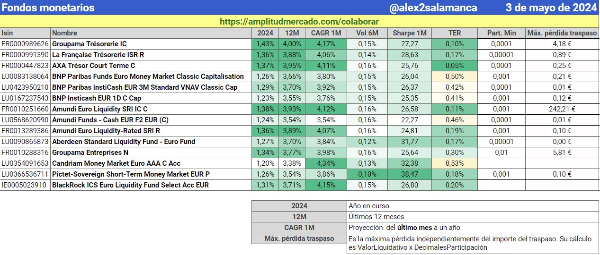

## Utilizing ChatGPT for Extracting Data from Financial Charts

When working with financial charts and tables, ChatGPT can serve as a powerful tool to streamline the analysis process, help visualize data, and draw out insightful information from complex datasets. Here are some examples of how you can leverage ChatGPT to extract and utilize data from an image of a financial table, like this one:

### 1. **Extracting Specific Data Points**

#### **Input Prompt:**
"Can you extract the fund names and their respective CAGR 1M from the image I provided?"

#### **ChatGPT Output:**
- Groupama Trésorerie IC: 4.17%
- La Française Trésorerie ISR R: 4.06%
- AXA Trésor Court Terme C: 3.80%
- [Continue listing other funds]

This extraction helps quickly identify the funds and their short-term compounded annual growth rates.

### 2. **Identifying Best Performing Investments**

#### **Input Prompt:**
"Based on the image, which funds have the highest CAGR 1M and lowest TER?"

#### **ChatGPT Output:**
The fund with the highest CAGR 1M and lowest TER is Groupama Trésorerie IC with a CAGR of 4.17% and a TER of 0.10%. This indicates a potentially attractive short-term investment opportunity due to its lower cost and higher growth rate.

### 3. **Generating Visualizations**

#### **Input Prompt:**
"Can you generate a graph comparing the CAGR 1M and TER of all funds listed in the image?"

#### **ChatGPT Output:**
To generate this graph, I would plot each fund on a scatter plot with CAGR 1M on the x-axis and TER on the y-axis. This visualization will help you quickly discern the relationship between the cost of the fund and its short-term growth performance.

### 4. **Comparative Analysis**

#### **Input Prompt:**
"Compare the performance and costs of funds focusing on liquidity from the image."

#### **ChatGPT Output:**
- **BlackRock ICS Euro Liquidity Fund Select Acc EUR** has a moderate performance with a CAGR 1M of 3.71% and a TER of 0.20%.
- **Amundi Euro Liquidity SRI IC C** shows a slightly higher growth at a CAGR 1M of 3.93% with a lower TER of 0.11%.

This comparative analysis provides a clear picture of how liquidity-focused funds stack up against each other in terms of cost and performance.

### 5. **Projected Loss Analysis**

#### **Input Prompt:**
"Calculate the projected maximum loss for each fund based on the provided maximum loss formula in the image."

#### **ChatGPT Output:**
To calculate the projected maximum loss for each fund, I will apply the formula as described in the image. For example, for BlackRock ICS Euro Liquidity Fund Select Acc EUR:
- Maximum Loss = Net Asset Value * Decimal Participation * Maximum Loss Per Transfer.

This calculation will be individually done for each fund to provide a risk assessment metric.

### Conclusion
By utilizing ChatGPT for these operations, you can significantly enhance your financial analysis, enabling quicker decision-making and deeper insights into investment opportunities. These functions can be performed either directly through text-based data extraction or by integrating Python scripts to automate calculations and generate visual data representations.
